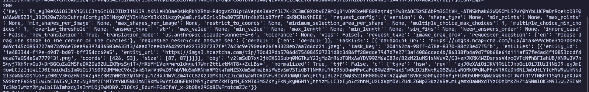

# Hcap_Challenge_fetcher



## What it does

1. Grabs the current hCaptcha version from `api.js`
2. Hits `checksiteconfig` to get the PoW challenge (`c` object + `req` JWT)
3. Decodes the JWT to find the `hsw.js` path
4. Runs `hsw.js` in a headless Chromium via Playwright to solve the PoW and get `n`
5. Hits `getcaptcha` with the solved `n` and gets back the full challenge (tasklist, entities, task images)

## Requirements

```
pip install requests playwright
playwright install chromium
```

## Usage

```
python main.py
```

## Output

Returns the full challenge JSON including `key`, `request_type`, `tasklist`, and a new `c` object for checkcaptcha.

## Notes

- `checkcaptcha` not implemented — this only fetches the challenge
- HSW PoW is solved by running `hsw.js` inside a headless Chromium browser via Playwright — not a pure Python implementation
