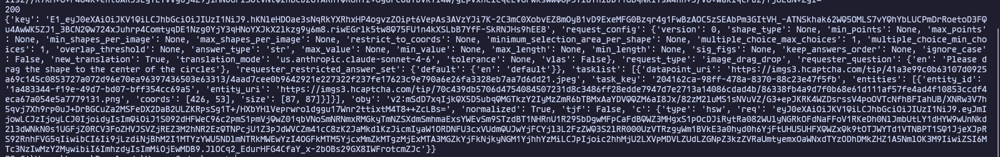

# Hcap_Challenge_fetcher


## What it does
Fetches hCaptcha challenges by solving the PoW chain (hsw -> hsj -> hsl) and hitting `getcaptcha`. Run `main.py` and pick which stage you want:

- **hsw** - grabs `api.js` version, hits `checksiteconfig` to get the PoW `req`, decodes the JWT to find the `hsw.js` path, runs `hsw.js` in a headless browser (Camoufox) to solve the PoW and get `n`, then hits `getcaptcha` with it.
- **hsj** - same as hsw but goes one step further: takes the hsw `req`, submits it as a failed `c` (`type: hsw`) to `getcaptcha` to get a new `req`, then solves that with `hsj.js` instead.
- **hsl** - chains all three: hsw `req` -> submitted as failed `hsw` -> get `hsj` `req` -> submitted as failed `hsj` -> get `hsl` `req` -> solved with `hsl.js`.

Each mode ends by hitting `getcaptcha` with the solved `n` and dumping the response to `res.json` in the project root.

## Requirements
```
pip install requests camoufox
camoufox fetch
```

## Usage
```
python main.py
```
Then type `hsw`, `hsj`, or `hsl` when prompted.

## Structure
```
main.py
modules/
  hsw.py
  hsj.py
  hsl.py
```

## Output
`res.json` - full `getcaptcha` response (`key`, `request_type`, `tasklist`, new `c` for checkcaptcha, etc).

## Notes
- `checkcaptcha` not implemented - this only fetches the challenge
- PoW is solved by running the site's own JS (`hsw.js`/`hsj.js`/`hsl.js`) inside a headless browser via Camoufox, not a pure Python implementation
- `sitekey` is hardcoded per mode (Discord's for hsw, a different one for hsj/hsl) - swap it if you're targeting something else
